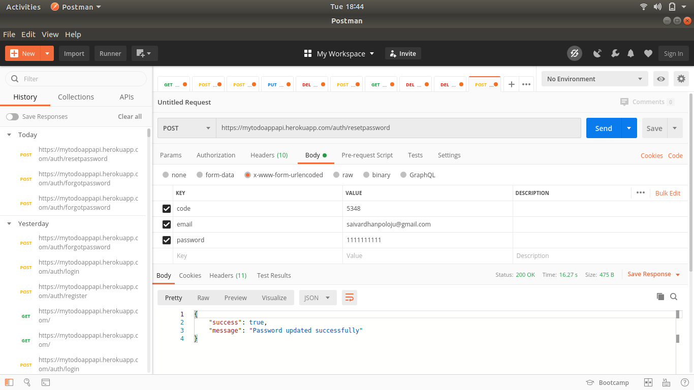

# My ToDo App REST API
## Description: 
    This is a simple REST API developed with NodeJS. The main theme behind this application is to provide all CRUD operations for ToDo Application.
    The set of API's provided in this application are
        1. register
        2. login
        3. forgotpassword
        4. resetpassword
        5. addItem
        6. addDocument
        7. getItems
        8. getItem
        9. updateItem
        10. toggleItem
        11. deleteItem
## Prerequisites:
* node v8.10.0
* npm v3.5.2
* express
* mongoose
* bodyparser
* passport
* jsonwebtoken
* bcryptjs
## API's and Usage:
1. register
    * Details:
        ``` 
        @type: POST
        @route: https://mytodoappapi/.herokuapp.com/auth/register
        @access: PUBLIC
        @description: This is route for new user registration
        ```
    * Request-Structure: 
        ```
        body: {
                email: "yourmail@mailprovider.com"
                password: "**********"
                name: "Your fullname"
            }
        ```
    * Response-Structure:
        ```
        {
            success: true,
            message: "Registration completed successfully"
        }
         or 
        {
            success: false,
            message: "email is already exists"
        }
         or 
        {
            success: false, 
            message: "Internal server error"
        }
        ```
    * Example: 

        
2. login
    * Details:
        ``` 
        @type: POST
        @route: https://mytodoappapi/.herokuapp.com/auth/login
        @access: PUBLIC
        @description: This is route for user login
        ```
    * Request-Structure: 
        ```
        body: {
                email: "yourmail@mailprovider.com"
                password: "**********"
            }
        ```
    * Response-Structure:
        ```
        {
            success: true,
            message: "You login successfully",
            token: "Bearer token"
        }
         or 
        {
            success: false,
            message: "credentials mismatch"
        }
         or 
        {
            success: false, 
            message: "Internal server error"
        }
        ```
    * Example: 
    
        
3. forgotpassword
    * Details:
        ``` 
        @type: POST
        @route: https://mytodoappapi/.herokuapp.com/auth/forgotpassword
        @access: PUBLIC
        @description: This is route for user to request for new password
        ```
    * Request-Structure: 
        ```
        body: {
                email: "yourmail@mailprovider.com"
            }
        ```
    * Response-Structure:
        ```
        {
            success: true,
            message: "A mail is sended with reset code to your registered email. Please check your mail."
        }
         or 
        {
            success: false,
            message: "Email not exists"
        }
         or 
        {
            success: false, 
            message: "Internal server error"
        }
        ```
    * Example: 
    
        
4. resetpassword
    * Details:
        ``` 
        @type: POST
        @route: https://mytodoappapi/.herokuapp.com/auth/resetpassword
        @access: PUBLIC
        @description: This is route for user to reset new password with otp
        ```
    * Request-Structure: 
        ```
        body: {
                code: "4 digit code already sended to registered mail"
                email: "yourmail@mailprovider.com",
                password: "**********",
            }
        ```
    * Response-Structure:
        ```
        {
            success: true,
            message: "Password updated successfully"
        }
         or 
        {
            success: false,
            message: "Email not exists"
        }
         or 
        {
            success: false,
            message: "Please enter valid code"
        }
         or 
        {
            success: false, 
            message: "Internal server error"
        }
        ```
    * Example: 
    
        
5. addItem
    * Details:
        ``` 
        @type: POST
        @route: https://mytodoappapi/.herokuapp.com/item/addItem
        @access: PRIVATE
        @description: This is route to add new Item
        ```
    * Request-Structure: 
        ```
        Headers: {
                Authorization: "Bearer token"
            }
        body: {
                name: "todo name",
                description: "description"
            }
        ```
    * Response-Structure:
        ```
        {
            success: true,
            message: "Item added successfully"
        }
         or 
        {
            success: false, 
            message: "Error in inserting item"
        }
         or 
        {
            success: false, 
            message: "Internal server error"
        }
        ```
    * Example: 

        
6. addDocument
    * Details:
        ``` 
        @type: POST
        @route: https://mytodoappapi/.herokuapp.com/item/addDocument
        @access: PRIVATE
        @description: This is route to add array of items
        ```
    * Request-Structure: 
        ```
        Headers: {
                Authorization: "Bearer token"
            }
        body: {
                items : [
                            {
                                name: "todo1 name",
                                description: "description1",
                                email: "yourmail@mailprovider.com"
                            },
                            {
                                name: "todo2 name",
                                description: "description3",
                                email: "yourmail@mailprovider.com"
                            },...
                        ]
            }
        ```
    * Response-Structure:
        ```
        {
            success: true,
            message: "Document added successfully"
        }
         or 
        {
            success: false, 
            message: "Error in inserting document"
        }
         or 
        {
            success: false, 
            message: "Internal server error"
        }
        ```
    * Example: 

        
7. getItems
    * Details:
        ``` 
        @type: GET
        @route: https://mytodoappapi/.herokuapp.com/item/getItems
        @access: PRIVATE
        @description: This is route to get array of items
        ```
    * Request-Structure: 
        ```
        Headers: {
                Authorization: "Bearer token"
            }
        ```
    * Response-Structure:
        ```
        {
            success: true,
            message: "Item list found",
            items: [
                {
                    done: false,
                    date: "2020-04-27T06:55:39.944Z",
                    _id: "5ea682889f7b191a2a7a6bf6",
                    name: "newTodo",
                    description: "description",
                    email: "vardhanscripter@gmail.com",
                    __v: 0
                },...
            ]
        }
         or 
        {
            success: false, 
            message: "No data found"
        }
         or 
        {
            success: false, 
            message: "Internal server error"
        }
        ```
    * Example: 

        
8. getItem
    * Details:
        ``` 
        @type: GET
        @route: https://mytodoappapi/.herokuapp.com/item/getItems/:id
        @access: PRIVATE
        @description: This is route to get an item based on id
        ```
    * Request-Structure: 
        ```
        Headers: {
                Authorization: "Bearer token"
            }
        ```
    * Response-Structure:
        ```
        {
            success: true,
            message: "Item found",
            item: [{
                    done: false,
                    date: "2020-04-27T06:55:39.944Z",
                    _id: "5ea682889f7b191a2a7a6bf6",
                    name: "newTodo",
                    description: "description",
                    email: "vardhanscripter@gmail.com",
                    __v: 0
                }]
        }
         or 
        {
            success: false, 
            message: "No data found"
        }
         or 
        {
            success: false, 
            message: "Internal server error"
        }
        ```
    * Example: 

        
9. updateItem
    * Details:
        ``` 
        @type: PUT
        @route: https://mytodoappapi/.herokuapp.com/item/updateItem/:id
        @access: PRIVATE
        @description: This is route to update item based on id
        ```
    * Request-Structure: 
        ```
        Headers: {
                Authorization: "Bearer token"
            }
        body: {
                name: "NewChangedTodo",
                description: "NewChangedDescription"
            }
        ```
    * Response-Structure:
        ```
        {
            success: true,
            message: "Item updated successfully"
        }
         or 
        {
            success: false, 
            message: "Error in updating item"
        }
         or 
        {
            success: false, 
            message: "Internal server error"
        }
        ```
    * Example: 

        
10. toggleItem
    * Details:
        ``` 
        @type: PUT
        @route: https://mytodoappapi/.herokuapp.com/item/toggleItem/:id
        @access: PRIVATE
        @description: This is route to update toggle of item based on id
        ```
    * Request-Structure: 
        ```
        Headers: {
                Authorization: "Bearer token"
            }
        ```
    * Response-Structure:
        ```
        {
            success: true
        }
         or 
        {
            success: false, 
            message: "Error in updating item"
        }
         or 
        {
            success: false, 
            message: "Internal server error"
        }
        ```
    * Example: 

        
11. deleteItem
    * Details:
        ``` 
        @type: DELETE
        @route: https://mytodoappapi/.herokuapp.com/item/deleteItem/:id
        @access: PRIVATE
        @description: This is route to delete item based on id
        ```
    * Request-Structure: 
        ```
        Headers: {
                Authorization: "Bearer token"
            }
        ```
    * Response-Structure:
        ```
        {
            success: true,
            message: "Item deleted successfully"
        }
         or 
        {
            success: false, 
            message: "Error in deleting item"
        }
         or 
        {
            success: false, 
            message: "Internal server error"
        }
        ```
    * Example: 

        