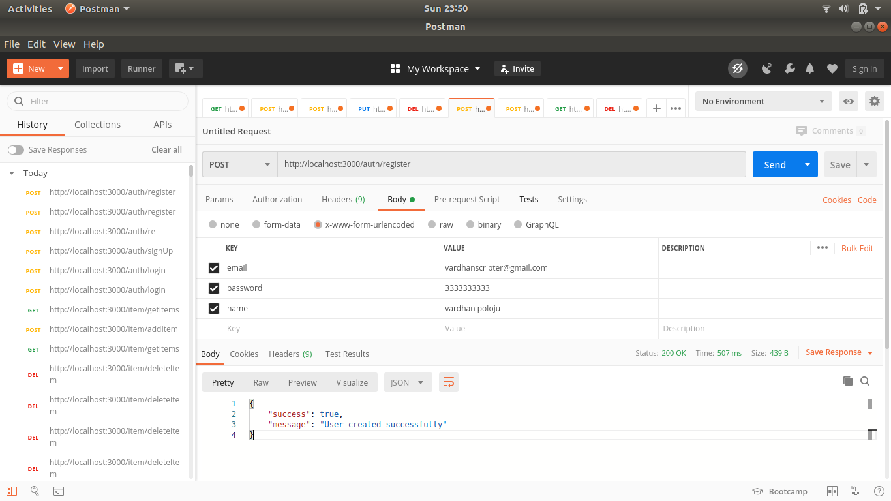
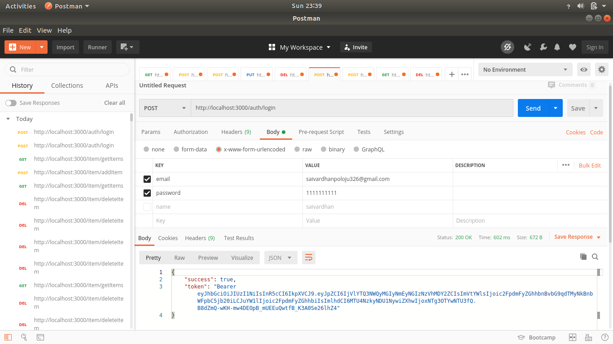
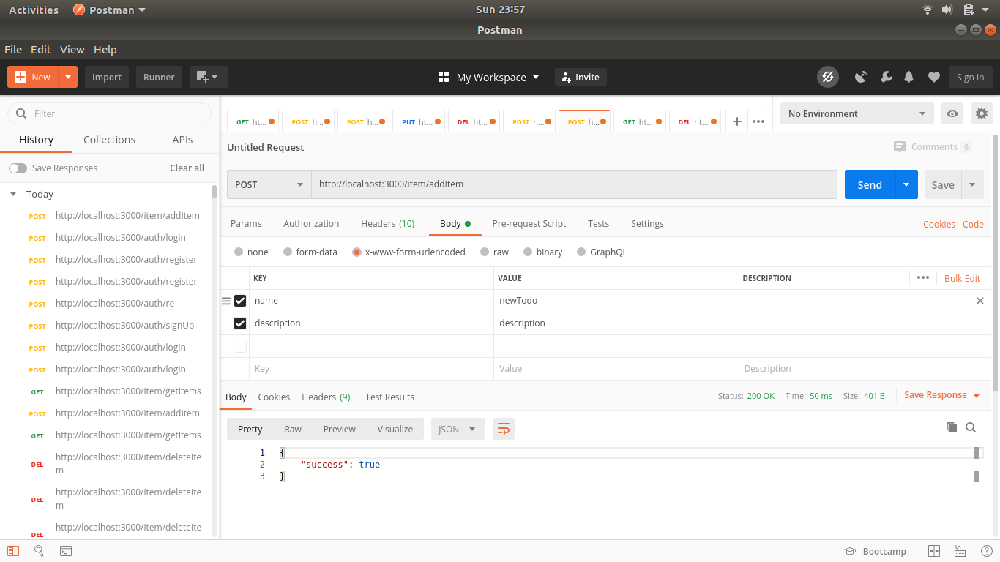
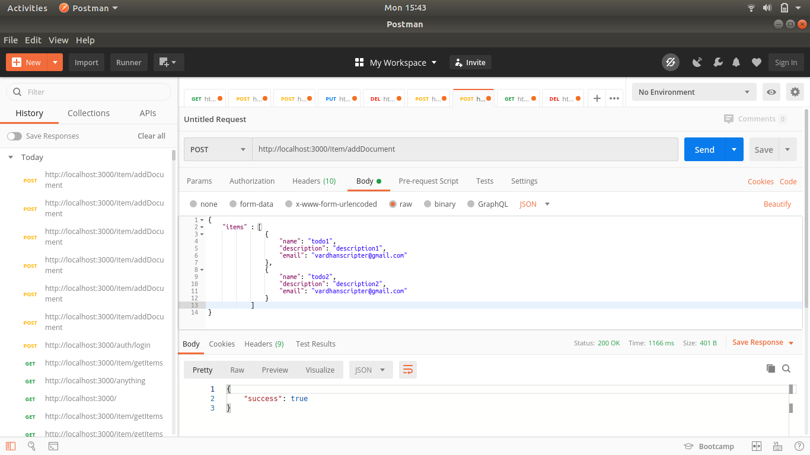
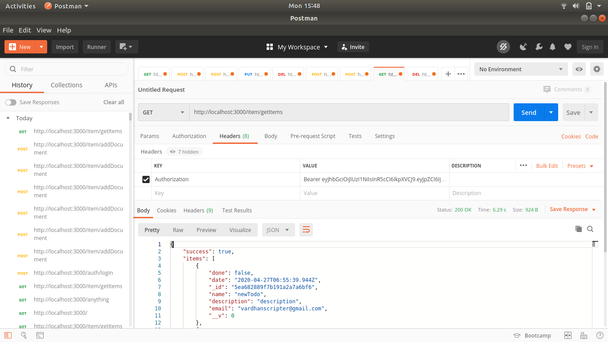
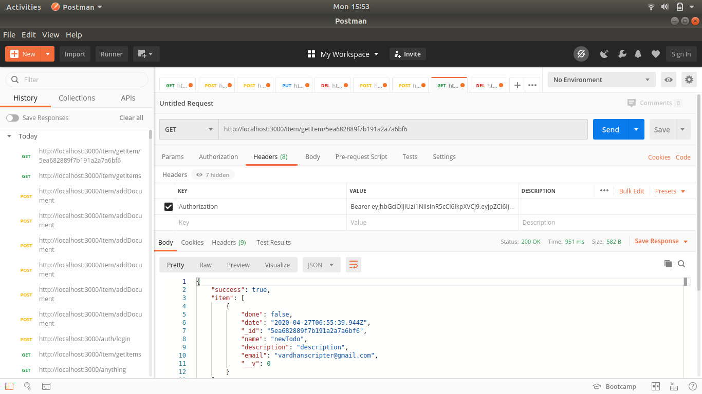
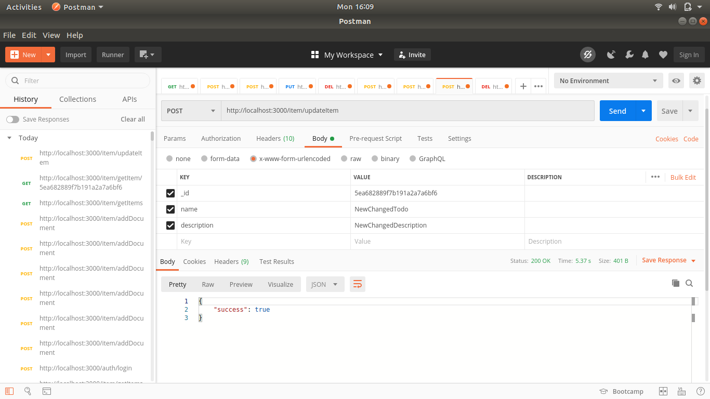
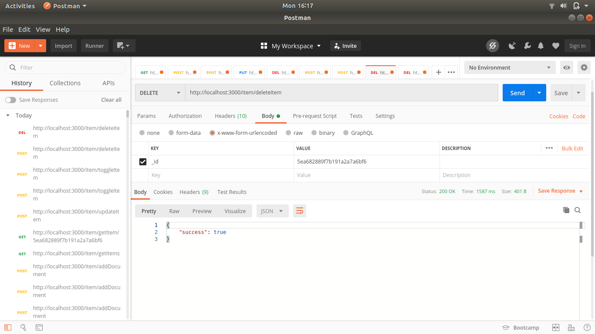

# My ToDo App REST API
## Description: 
    This is a simple REST API developed with NodeJS. The main theme behind this application is to provide all CRUD operations for ToDo Application.
    The set of API's provided in this application are
        1. register
        2. login
        3. addItem
        4. addDocument
        5. getItems
        6. getItem
        7. updateItem
        8. toggleItem
        9. deleteItem
## Prerequisites:
* node v8.10.0
* npm v3.5.2
* express
* mongoose
* bodyparser
* passport
* jsonwebtoken
* bcryptjs
## API's and Usage:
1. register
    * Details:
        ``` 
        @type: POST
        @route: localhost:3000/auth/register
        @access: PUBLIC
        @description: This is route for new user registration
        ```
    * Request-Structure: 
        ```
        body: {
                email: "yourmail@mailprovider.com"
                password: "**********"
                name: "Your fullname"
            }
        ```
    * Response-Structure:
        ```
        {
            success: true,
            message: "User created successfully"
        }
         or 
        {
            success: false,
            Errormessage: "email is already exists"
        }
         or 
        {
            success: false, 
            Errormessage: "Internal server error"
        }
        ```
    * Example: 

        
2. login
    * Details:
        ``` 
        @type: POST
        @route: localhost:3000/auth/login
        @access: PUBLIC
        @description: This is route for user login
        ```
    * Request-Structure: 
        ```
        body: {
                email: "yourmail@mailprovider.com"
                password: "**********"
            }
        ```
    * Response-Structure:
        ```
        {
            success: true,
            token: "Bearer token"
        }
         or 
        {
            success: false,
            Errormessage: "credentials mismatch"
        }
         or 
        {
            success: false, 
            Errormessage: "Internal server error"
        }
        ```
    * Example: 
    
        
3. addItem
    * Details:
        ``` 
        @type: POST
        @route: localhost:3000/item/addItem
        @access: PRIVATE
        @description: This is route to add new Item
        ```
    * Request-Structure: 
        ```
        Headers: {
                Authorization: "Bearer token"
            }
        body: {
                name: "todo name",
                description: "description"
            }
        ```
    * Response-Structure:
        ```
        {
            success: true
        }
         or 
        {
            success: false, 
            Errormessage: "Error in inserting item"
        }
         or 
        {
            success: false, 
            Errormessage: "Internal server error"
        }
        ```
    * Example: 

        
4. addDocument
    * Details:
        ``` 
        @type: POST
        @route: localhost:3000/item/addDocument
        @access: PRIVATE
        @description: This is route to add array of items
        ```
    * Request-Structure: 
        ```
        Headers: {
                Authorization: "Bearer token"
            }
        body: {
                items : [
                            {
                                name: "todo1 name",
                                description: "description1",
                                email: "yourmail@mailprovider.com"
                            },
                            {
                                name: "todo2 name",
                                description: "description3",
                                email: "yourmail@mailprovider.com"
                            },...
                        ]
            }
        ```
    * Response-Structure:
        ```
        {
            success: true
        }
         or 
        {
            success: false, 
            Errormessage: "Error in inserting document"
        }
         or 
        {
            success: false, 
            Errormessage: "Internal server error"
        }
        ```
    * Example: 

        
5. getItems
    * Details:
        ``` 
        @type: GET
        @route: localhost:3000/item/getItems
        @access: PRIVATE
        @description: This is route to get array of items
        ```
    * Request-Structure: 
        ```
        Headers: {
                Authorization: "Bearer token"
            }
        ```
    * Response-Structure:
        ```
        {
            success: true,
            items: [
                {
                    done: false,
                    date: "2020-04-27T06:55:39.944Z",
                    _id: "5ea682889f7b191a2a7a6bf6",
                    name: "newTodo",
                    description: "description",
                    email: "vardhanscripter@gmail.com",
                    __v: 0
                },...
            ]
        }
         or 
        {
            success: false, 
            Errormessage: "No data found"
        }
         or 
        {
            success: false, 
            Errormessage: "Internal server error"
        }
        ```
    * Example: 

        
6. getItem
    * Details:
        ``` 
        @type: GET
        @route: localhost:3000/item/getItems/:_id
        @access: PRIVATE
        @description: This is route to get an item based on _id
        ```
    * Request-Structure: 
        ```
        Headers: {
                Authorization: "Bearer token"
            }
        ```
    * Response-Structure:
        ```
        {
            success: true,
            item: {
                    done: false,
                    date: "2020-04-27T06:55:39.944Z",
                    _id: "5ea682889f7b191a2a7a6bf6",
                    name: "newTodo",
                    description: "description",
                    email: "vardhanscripter@gmail.com",
                    __v: 0
                }
        }
         or 
        {
            success: false, 
            Errormessage: "No data found"
        }
         or 
        {
            success: false, 
            Errormessage: "Internal server error"
        }
        ```
    * Example: 

        
7. updateItem
    * Details:
        ``` 
        @type: POST
        @route: localhost:3000/item/updateItem
        @access: PRIVATE
        @description: This is route to update item based on _id
        ```
    * Request-Structure: 
        ```
        Headers: {
                Authorization: "Bearer token"
            }
        body: {
                _id: "ID of item to update",
                name: "NewChangedTodo",
                description: "NewChangedDescription"
            }
        ```
    * Response-Structure:
        ```
        {
            success: true
        }
         or 
        {
            success: false, 
            Errormessage: "Error in updating item"
        }
         or 
        {
            success: false, 
            Errormessage: "Internal server error"
        }
        ```
    * Example: 

        
8. toggleItem
    * Details:
        ``` 
        @type: POST
        @route: localhost:3000/item/toggleItem
        @access: PRIVATE
        @description: This is route to update toggle of item based on _id
        ```
    * Request-Structure: 
        ```
        Headers: {
                Authorization: "Bearer token"
            }
        body: {
                _id: "ID of item to update"
            }
        ```
    * Response-Structure:
        ```
        {
            success: true
        }
         or 
        {
            success: false, 
            Errormessage: "Error in updating item"
        }
         or 
        {
            success: false, 
            Errormessage: "Internal server error"
        }
        ```
    * Example: 

        
8. deleteItem
    * Details:
        ``` 
        @type: DELETE
        @route: localhost:3000/item/deleteItem
        @access: PRIVATE
        @description: This is route to delete item based on _id
        ```
    * Request-Structure: 
        ```
        Headers: {
                Authorization: "Bearer token"
            }
        body: {
                _id: "ID of item to delete"
            }
        ```
    * Response-Structure:
        ```
        {
            success: true
        }
         or 
        {
            success: false, 
            Errormessage: "Error in deleting item"
        }
         or 
        {
            success: false, 
            Errormessage: "Internal server error"
        }
        ```
    * Example: 

        
