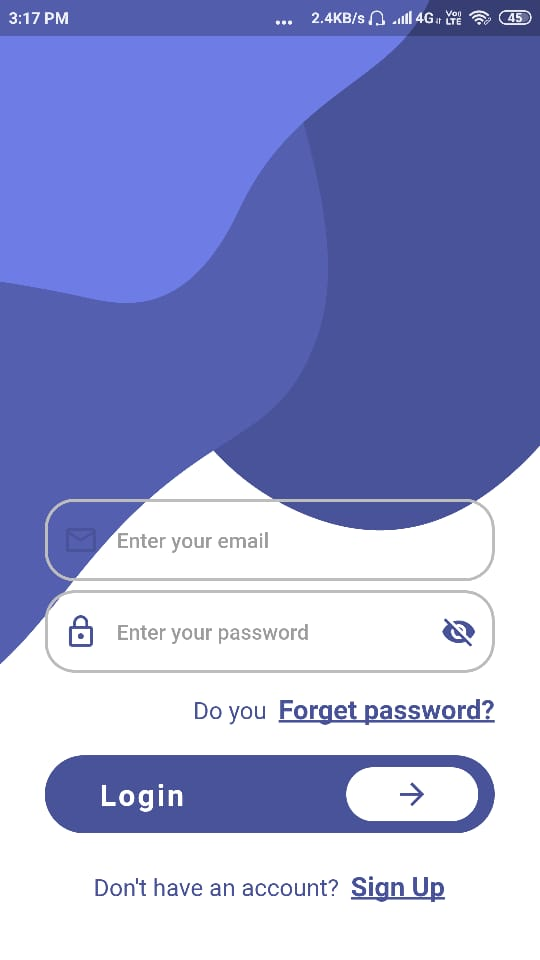
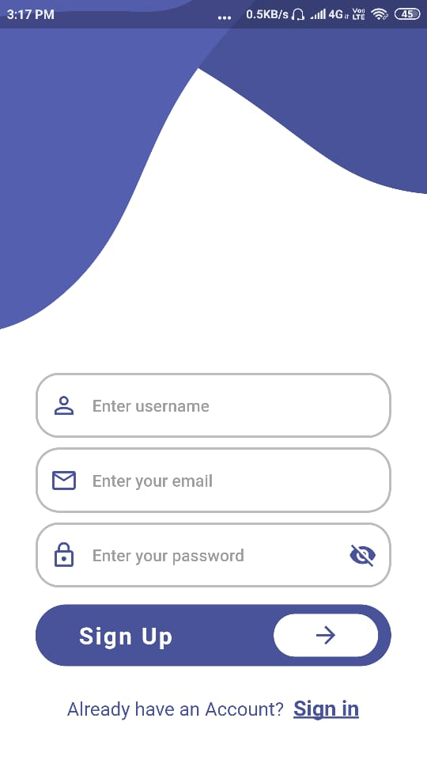
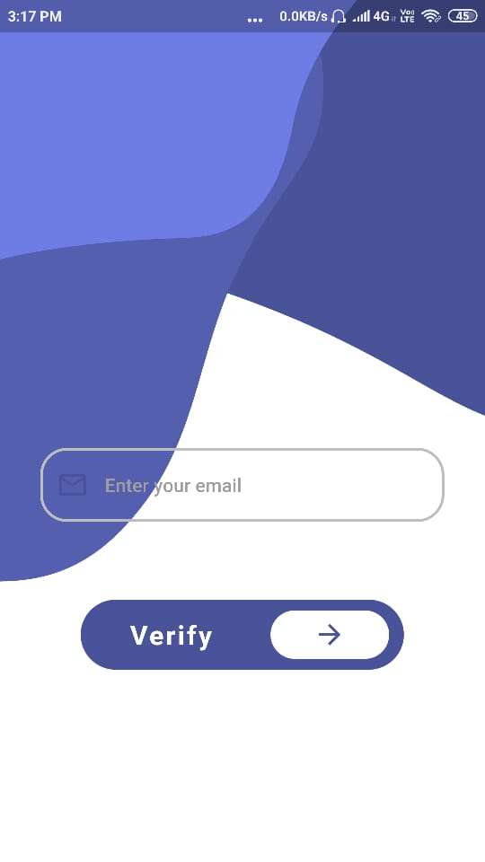
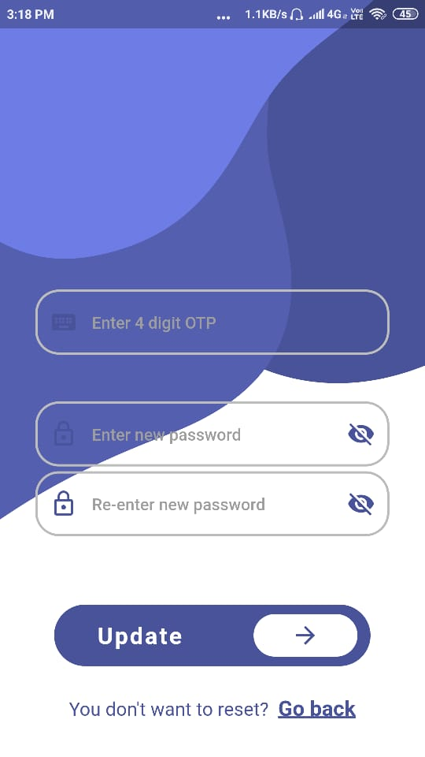
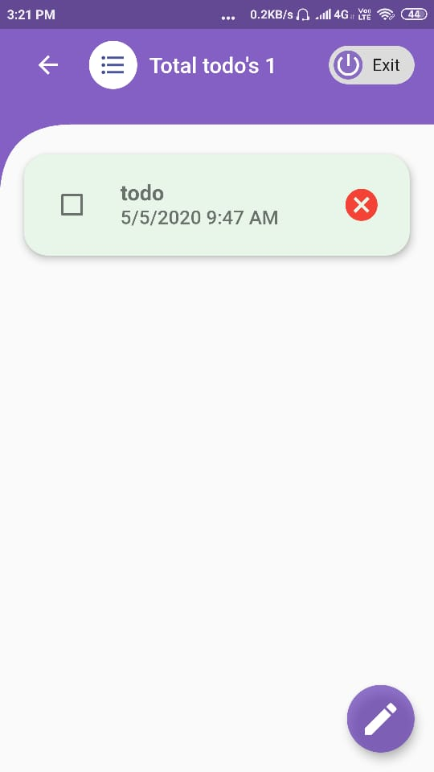
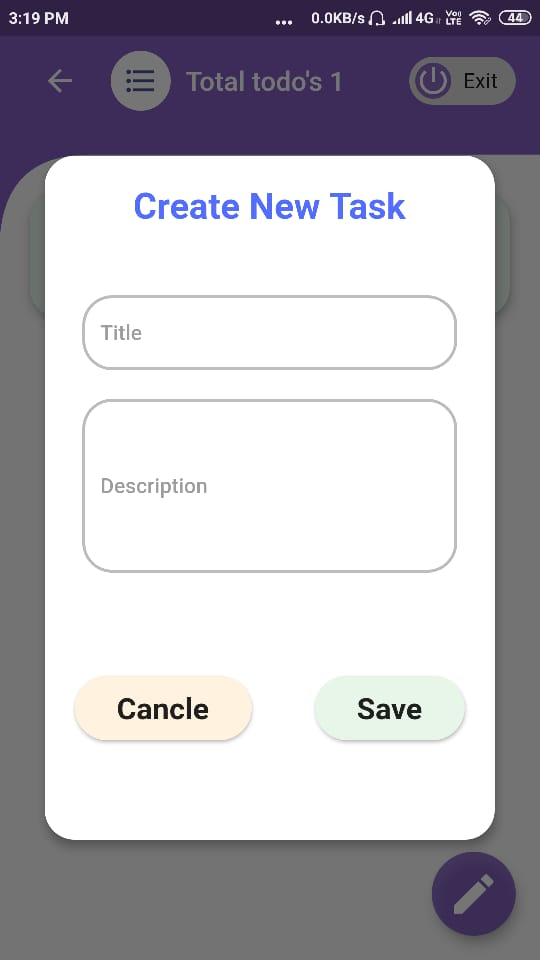
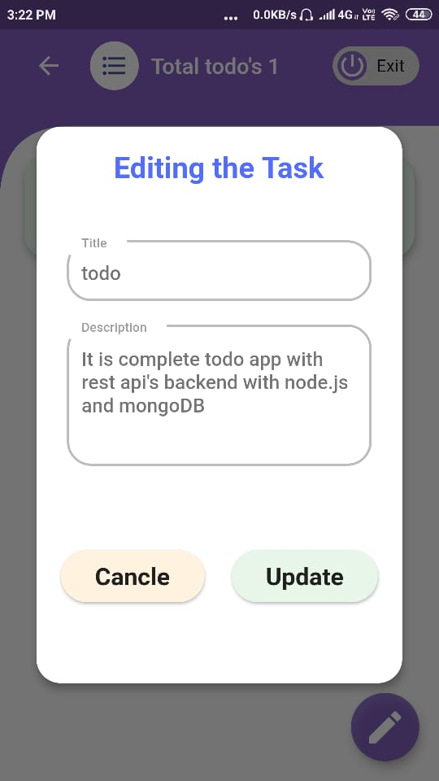
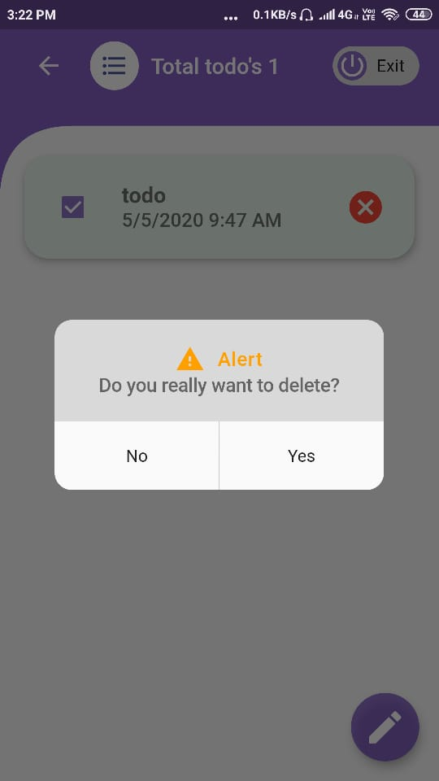
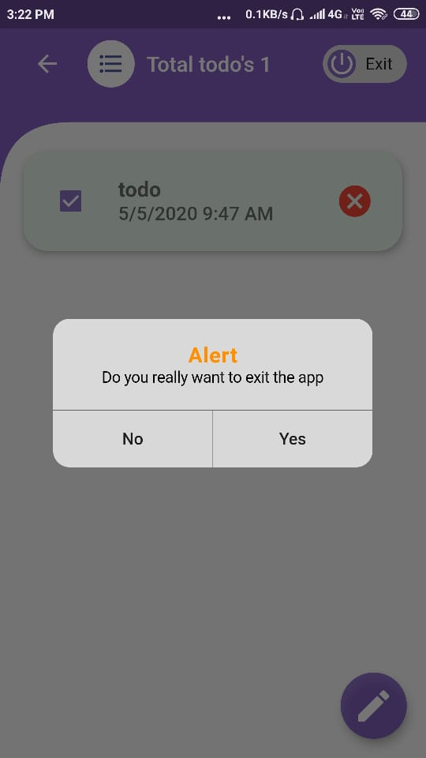

# todotask

A new Flutter Todey application.

### App screens

login page |sign up page | forgotpassword page
:-------------------------:|:-------------------------:|:-------------------------:
 |   | 
 click on the login button   to login   click on the signup to create account|click on the signup button to create account click on the signin to go back | click on verify button to verify   and to get verification code

 reset password page |home page | create todo page  
:-------------------------:|:-------------------------:|:-------------------------:
 |   | 
 click on the update button   to update password   click on the bo back to come back | click on Edit button to create   new Todo| click on save button to save   new Todo 

 update todo page |update home page|logout alert 
 :-------------------------:|:------------------:|:---------------:
| |   
 |click on the card to update the todo||click on the exit chip to logout|

delete todo alert|exit the app alert
:-------------------------:|:-------------------------:|
  |
  click on the cancel icon to delete todo | press on the system back button to exit app

##### Install the app,test yourself and feel free to comment
[apk](apks/app.apk) link

# Technology stack 

1. Flutter Framwork [documentation](https://flutter.dev/docs), which offers tutorials,
samples, guidance on mobile development, and a full API reference.
2. MongoDb [documentation](https://docs.mongodb.com/) for storing the todo's
3. Node.js [documentation](https://nodejs.org/en/docs/) for backend to interact with the databse

## Getting Started

This project is a starting point for a Flutter application.

A few resources to get you started if this is your first Flutter project:

- [Lab: Write your first Flutter app](https://flutter.dev/docs/get-started/codelab)
- [Cookbook: Useful Flutter samples](https://flutter.dev/docs/cookbook)

### Project Dependencies:

* [android studio](https://developer.android.com/studio) or [vs code](https://code.visualstudio.com/)
 
    <!-- 1. [hive](https://pub.dev/packages/hive#-readme-tab-) Hive is a lightweight and blazing fast key-value database written in pure Dart. By using this package we can perform the database operations.
    2. [hive_flutter](https://pub.dev/packages/hive_flutter) package it gives the support to hive package.
    3. [hive_generator](https://pub.dev/packages/hive_generator) package(dev dependency) for generating the custom objects for hive database.
    4. [build_runner](https://pub.dev/packages/build_runner) package provides a concrete way of generating files using Dart code. 
    5. [path_provider](https://pub.dev/packages/path_provider) package to getting the directory path(Location) for the hive database to store the todo's -->
* [dio](https://pub.dev/packages/dio) package, It is a powerful Http client for Dart, which supports Interceptors, Global configuration, FormData, Request Cancellation, File downloading, Timeout etc. {OR} [http](https://pub.dev/packages/http) This package contains a set of high-level functions and classes that make it easy to consume HTTP resources. It's platform-independent, and can be used on both the command-line and the browser.
- [toast](https://pub.dev/packages/fluttertoast) to display something to user if some action happen
- [shared_preferences](https://pub.dev/packages/shared_preferences) providing a persistent store for simple data. Data is persisted to disk asynchronously. Neither platform can guarantee that writes will be persisted to disk after returning and this plugin must not be used for storing critical data.
- [flutter_spinkit](https://pub.dev/packages/flutter_spinkit) A collection of loading indicators animated with flutter.
- [intl](https://pub.dev/packages/intl) This package provides internationalization and localization facilities, including message translation, plurals and genders, date/number formatting and parsing, and bidirectional text.
- [flare_flutter](https://pub.dev/packages/flare_flutter) If you plan on writing a custom controller or want access to more of the guts of the library, you will want to also include flare_dart which is the base library responsible for loading, instancing, animating, and doing all the work

Thank you 😍️😍️😍️
 